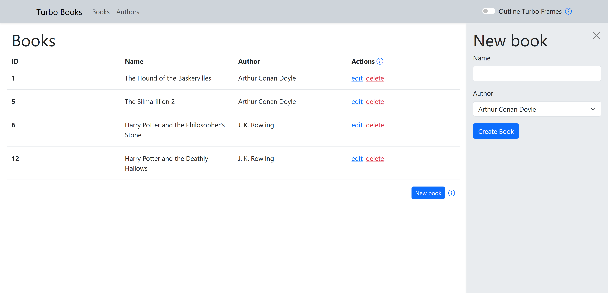

# Turbo Books

This project is a small demo of what can be achieved using Turbo Frames only. Explanations are
interactively provided for parts of the system.

## Getting started

Simply run `bin/setup` to install dependencies and create the database.
Run `bin/rails s` to start the application afterwards.

